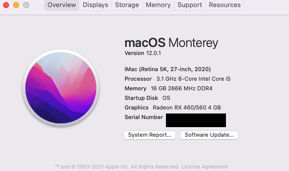
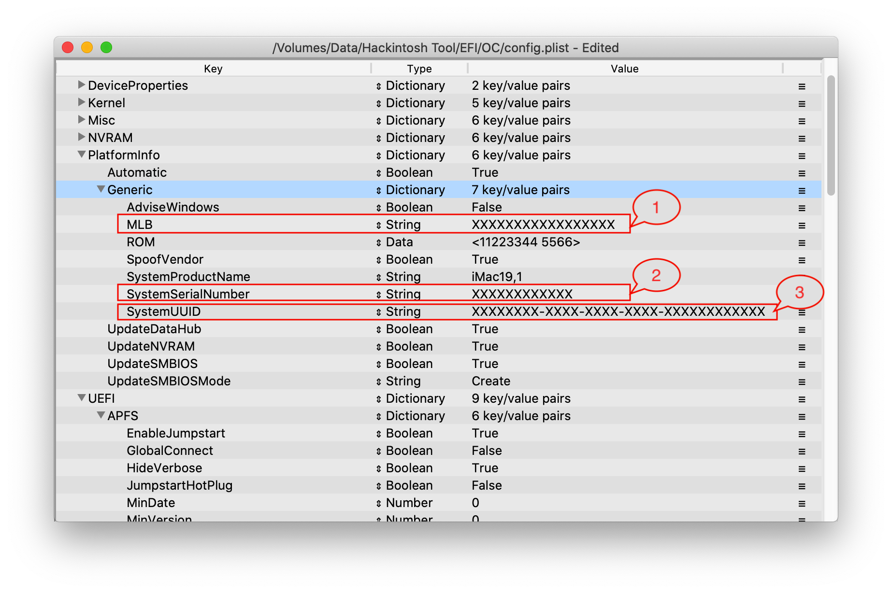

# Specifications
```
Gigabyte B460M Aorus Pro (Bios: F5c)
 - Audio: Realtek® ALC1200 codec
 - Ethernet: Intel® Ethernet Connection I219V12
Intel Core i5 10500
Ram 2 x 8GB 2666
SSD Samsung 970 evo plus
Wifi + Bluetooth BCM94360ng
Monitor Samsung 24 inch FHD
```

# OpenCore (Version: 0.7.5 - stable) + macOS Monterey (Version 12.0.1) or macOS Big Sur (Version 11.0+)
- https://dortania.github.io/OpenCore-Install-Guide/
- https://github.com/acidanthera/OpenCorePkg/releases/tag/0.7.5
# Kexts include
- AppleALC 
- IntelMausi 
- Lilu 
- NVMeFix 
- USBPorts
- VirtualSMC 
- WhateverGreen 
- XHCI-unsupported
- 
# Work??
- Intel Quick Sync
- Handoff, Air Drop
- Rear Jack Audio Output + Input and Front Jack
- Ethernet
- Wifi
- Bluetooth
- All USB Port
- Restart, Sleep and Shutdown 
- TRIM native 
- Etc
# Not Work??
- Etc
# Result


# Note For You

~~2.~~ The file config.plist. Please change MLB, SystemSerialNumber, SystemUUID
